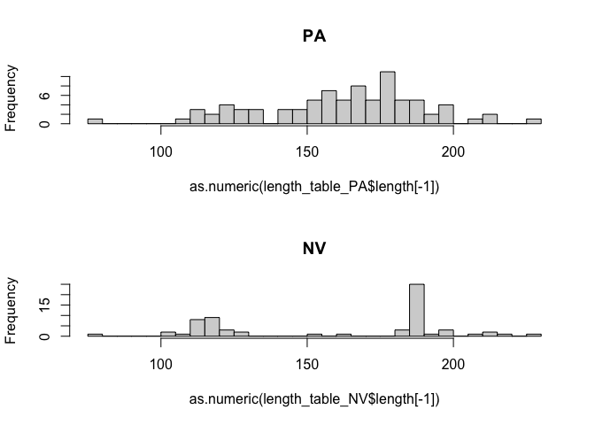

PA\_NV\_ambig\_seq\_analysis\_for\_tree
================

Let’s load the libraries we will need

First, we list files corresponding to the ambiguities sequences for each
sample. There is a separate folder for each group of samples.

``` r
#Now let's list the files in that folder
files_PA <- list.files("./PA_ambig_final_for_waddle_serdp", full.names = T)
files_NV <- list.files("./NV_ambig_final_for_waddle_serdp", full.names = T)
files_ref <- list.files("./PA_ambig_final_for_waddle_serdp", full.names = T)
```

Now let’s see how many sequences we have for each primer/sample. This is
calculated separately for each dataset (PA and NV)

``` r
#make empty objects
length_table_PA <- tibble(sample = "", length=0, file="")
length_table_NV <- tibble(sample = "", length=0, file="")

#extract sample names
samplenames_PA <- sapply(files_PA, function(x)unlist(strsplit(x,split=".fasta_primerfix.fasta_trim"))[1])
samplenames_PA <- sapply(samplenames_PA, function(x) unlist(strsplit(x, split="Sample."))[2])

samplenames_NV <- sapply(files_NV, function(x)unlist(strsplit(x,split=".fasta_primerfix.fasta_trim"))[1])
samplenames_NV <- sapply(samplenames_NV, function(x) unlist(strsplit(x, split="Sample."))[2])

#count number of sequences per sample

#for PA
for (i in 1: length(files_PA)){
    seq <- readDNAStringSet(files_PA[i], format = "fasta")
    length_table_PA <- add_row(length_table_PA, sample=samplenames_PA[i], length=length(seq), file=files_PA[i])
}

#for NV
for (i in 1: length(files_NV)){
    seq <- readDNAStringSet(files_NV[i], format = "fasta")
    length_table_NV <- add_row(length_table_NV, sample=samplenames_NV[i], length=length(seq), file=files_NV[i])
}

#plot the results
par(mfrow=c(2,1))
hist(as.numeric(length_table_PA$length[-1]), breaks=50, main="PA")
hist(as.numeric(length_table_NV$length[-1]), breaks=50, main="NV")
```

<!-- -->

``` r
#get list of only samples with at least 50 sequences 
files_PA_90 <- filter(length_table_PA, length>50)
filenames_PA_90 <- files_PA_90$file
length(filenames_PA_90)
```

    ## [1] 84

``` r
files_NV_90 <- filter(length_table_NV, length>50)
filenames_NV_90 <- files_NV_90$file
length(filenames_NV_90)
```

    ## [1] 65

Now that we have the samples selected, let’s fill in a matrix m with the
sequences. Each row is a sample and each column is a locus.

``` r
#make empty matrix of the right size for each dataset
m_PA <-matrix(NA, nrow=nrow(files_PA_90), ncol=243)
colnames(m_PA) <- seq(1,243)
rownames(m_PA) <- files_PA_90$sample
seq_matrix <- as_tibble(m_PA)

m_NV <-matrix(NA, nrow=nrow(files_NV_90), ncol=243)
colnames(m_NV) <- seq(1,243)
rownames(m_NV) <- files_NV_90$sample
seq_matrix <- as_tibble(m_NV)

#populate the empty matrix with the ambiguities sequences for PA
for (i in 1:length(filenames_PA_90)){
  seq <- readDNAStringSet(filenames_PA_90[i])
  for (j in 1:length(seq)){
    col_match <- as.numeric(names(seq))
    m_PA[i,col_match[j]] <- as.character(seq[j])
     }
}

#populate the empty matrix with the ambiguities sequences for NV
for (i in 1:length(filenames_NV_90)){
  seq <- readDNAStringSet(filenames_NV_90[i])
  for (j in 1:length(seq)){
    col_match <- as.numeric(names(seq))
    m_NV[i,col_match[j]] <- as.character(seq[j])
     }
}
```

Now we have a matrix m with samples as rows and primers as columns.
First we can eliminate primers with no data. Let’s get the average
length of each sequence to determine which has no data. We can also find
the min max and mean sequence length to identify potential bad
sequences.

Now let’s explore the problem amps. These are ones missing too much
data.

``` r
#identify amps with more than 1/2 missing data - only considering the samples of interest and not the reference samples (hence the +13)
badamps_PA <- which(as.numeric(n_bases_PA[,7]) > (.5*(length(filenames_PA_90)+13)))

badamps_NV <- which(as.numeric(n_bases_NV[,7]) > (.5*(length(filenames_NV_90)+13)))

#find the union so we use the same set of amps for both datasets
badamps_both <- union(badamps_NV, badamps_PA)

m_trim_PA <- m_PA[,-badamps_both]

m_trim_NV <- m_NV[,-badamps_both]

dim(m_trim_PA) 
```

    ## [1]  84 174

``` r
dim(m_trim_NV)
```

    ## [1]  65 174

For each sample with data, aligns all loci separately. This is done only
for the gene tree to species tree approach.

Now for this project I loaded the alignments for each locus into the
program geneious. From there I ran raxml for each locus using the
following command:

> raxmlHPC-SSE3-MAC -s input.phy -n output -m GTRCAT -f a -x 1 -N 100 -p
> 1

Then I exported the resulting consensus tree for each locus alignment. I
then used the utility newick-utils to collapse all nodes with \>10
bootstrap support using the following comand (with an example tree).
First download [newick-utils](https://github.com/tjunier/newick_utils).
Then in the command line navigate to the “src” folder in the newick
utils program files. Run the following.

> ./nw\_ed example\_raxml\_consensus\_locus\_tree.newick ‘i & b\<=10’ o
> \> example\_raxml\_consensus\_locus\_tree\_collapse10.newick

Next I concatenated all newick trees into one file to be input into
Astral. In the directory with all the trees (and only the trees) with
nodes collapsed I ran the following:

for mac:

> cat \* \> combined\_trees.newick

Finally I ran [Astral](https://github.com/smirarab/ASTRAL) using the set
of locus trees with \>10 bootstraps collapsed. I ran the following line
of code to run Astral:

> java -jar astral.5.6.2.jar -i combined\_trees.newick -o
> combined\_ambig.tre

This outputs your Astral Tree\! You can then use newick utils to
collapse nodes with low posterior support for display purposes.
