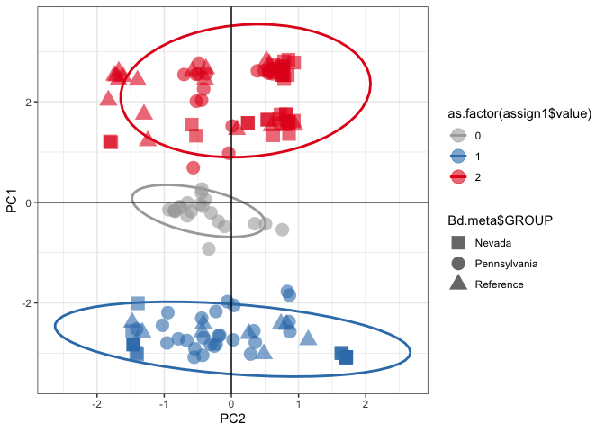
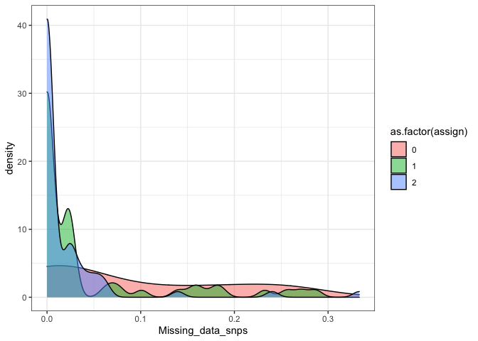

snp\_analysis\_nv\_pa
================

Once you have a VCF you can read it in and make it a genlight object.
Follow that with making a PCA. You will need meta data for each sample
(sample name and population)

read in VCF and match to metadata table.

``` r
#read in vcf calcualated using freebayes
Bd.VCF <- read.vcfR("NV_PA_Bd_wrefs_freebayes_trimmed_filtered.vcf")
```

    ## Scanning file to determine attributes.
    ## File attributes:
    ##   meta lines: 295
    ##   header_line: 296
    ##   variant count: 129
    ##   column count: 158
    ## Meta line 295 read in.
    ## All meta lines processed.
    ## gt matrix initialized.
    ## Character matrix gt created.
    ##   Character matrix gt rows: 129
    ##   Character matrix gt cols: 158
    ##   skip: 0
    ##   nrows: 129
    ##   row_num: 0
    ## Processed variant: 129
    ## All variants processed

``` r
#read in file with sample metadata
read_csv(file = "Bd_PA_NV_meta_trim_final.csv") -> Bd.meta
```

    ## 
    ## ── Column specification ────────────────────────────────────────────────────────
    ## cols(
    ##   Sample_ID = col_character(),
    ##   ORDER = col_double(),
    ##   GROUP = col_character(),
    ##   SamplingYear = col_double(),
    ##   SamplingDate = col_character(),
    ##   Sample_Type = col_character(),
    ##   Location = col_character(),
    ##   Missing_data_snps = col_double(),
    ##   N_amps_tree = col_double(),
    ##   pGPL2 = col_double(),
    ##   pGPL1 = col_double(),
    ##   GENOASSIGN = col_double(),
    ##   Site_code = col_double(),
    ##   Site = col_character(),
    ##   Species_code = col_character(),
    ##   Genus = col_character(),
    ##   species = col_character(),
    ##   Lat = col_double(),
    ##   Lon = col_double()
    ## )

``` r
#join in a meta table based on sample ID
colnames(Bd.VCF@gt)[-1] -> vcf.names
as.data.frame(vcf.names) -> vcf.names
colnames(vcf.names) <- "Sample_ID"
left_join(vcf.names, Bd.meta, by = "Sample_ID") -> vcf.meta

#check
all(colnames(Bd.VCF@gt)[-1] == vcf.meta$Sample)
```

    ## [1] TRUE

Make VCF object a genlight object. Set populations. Make PCA. use the
function subpop() to subset you factor levels if you want\!

``` r
gl.Bd <- vcfR2genlight(Bd.VCF)
ploidy(gl.Bd) <- 2
pop(gl.Bd) <- vcf.meta$GROUP

#get summary of data
gl.Bd
```

    ##  /// GENLIGHT OBJECT /////////
    ## 
    ##  // 149 genotypes,  129 binary SNPs, size: 252 Kb
    ##  731 (3.8 %) missing data
    ## 
    ##  // Basic content
    ##    @gen: list of 149 SNPbin
    ##    @ploidy: ploidy of each individual  (range: 2-2)
    ## 
    ##  // Optional content
    ##    @ind.names:  149 individual labels
    ##    @loc.names:  129 locus labels
    ##    @chromosome: factor storing chromosomes of the SNPs
    ##    @position: integer storing positions of the SNPs
    ##    @pop: population of each individual (group size range: 26-71)
    ##    @other: a list containing: elements without names

now to do a DAPC using adegenet

``` r
#finds clusters in data
grp <- find.clusters(gl.Bd, max.n.clust=10, n.pca = 100, choose.n.clust = F, criterion = "diffNgroup")

#run with 50 PCs 
dapc1 <- dapc(gl.Bd, grp$grp, n.pca=50, n.da=1)
summary(dapc1)
```

    ## $n.dim
    ## [1] 1
    ## 
    ## $n.pop
    ## [1] 2
    ## 
    ## $assign.prop
    ## [1] 1
    ## 
    ## $assign.per.pop
    ## 1 2 
    ## 1 1 
    ## 
    ## $prior.grp.size
    ## 
    ##  1  2 
    ## 87 62 
    ## 
    ## $post.grp.size
    ## 
    ##  1  2 
    ## 87 62

``` r
scatter(dapc1)
```

<!-- -->

``` r
#now this may be overfitting because we are using so many PCs. So lets find out how many PCs we should use

#then use this to find the optimal number of PCs to use
temp <- optim.a.score(dapc1)
```

<!-- -->

``` r
#ran this 10x and got the following optimal alpha scores:
#1, 1, 1, 1, 1, 1, 1, 1, 1, 1, 1

#run the DAPC again now we will just use 2 PCs
dapc1 <- dapc(gl.Bd, grp$grp, n.pca=2, n.da=1)

#to explore split
scatter(dapc1)
```

<!-- -->

``` r
#to get summary
summary(dapc1)
```

    ## $n.dim
    ## [1] 1
    ## 
    ## $n.pop
    ## [1] 2
    ## 
    ## $assign.prop
    ## [1] 0.9932886
    ## 
    ## $assign.per.pop
    ##        1        2 
    ## 1.000000 0.983871 
    ## 
    ## $prior.grp.size
    ## 
    ##  1  2 
    ## 87 62 
    ## 
    ## $post.grp.size
    ## 
    ##  1  2 
    ## 88 61

``` r
#to see assignment probabilities
assignplot(dapc1)
```

<!-- -->

``` r
#For instance,which are the most ’admixed’ individuals? Let us consider as admixed individuals having no more than 99% of probability of membership in a single cluster:
 
unassign <- which(apply(dapc1$posterior,1, function(e) all(e<0.99)))
unassign <- as.numeric(unassign)

assign1 <- as_tibble(as.numeric(dapc1$assign))
assign1[unassign,] <- 0

#sometimes the 1/2 values are switched and don't necessarily correspond to GPL1/2. Go back and check and fix them with this code if needed.
#to fix the switched GPL1/2 values
#assign1[assign1$value==1,] <- 3
#assign1[assign1$value==2,] <- 1
#assign1[assign1$value==3,] <- 2


#write.csv(cbind(dapc1$posterior, assign1), file="serdp_and_waddle_dapc_posterior_2clust_99cut_2PC_samptrim_90.csv")

vcf.meta <- cbind(vcf.meta, assign=assign1$value)
```

Now we use the assignments to make a PCA

``` r
pca <- glPca(gl.Bd, nf = 3)
barplot(100*pca$eig/sum(pca$eig), col = heat.colors(50), main="PCA Eigenvalues")
title(ylab="Percent of variance\nexplained", line = 2)
title(xlab="Eigenvalues", line = 1)
```

<!-- -->

``` r
pca.scores <- as.data.frame(pca$scores)

cols <- brewer.pal(n_distinct(assign1$value), "Set1")


p <- ggplot(pca.scores, aes(x=PC2, y=PC1, colour=as.factor(assign1$value), shape=Bd.meta$GROUP)) + 
  geom_point(size=5, alpha = 0.6 ) + 
  scale_color_manual(values = c("dark grey",cols[2],cols[1])) + 
  scale_shape_manual(values = c(15, 16, 17)) +
  stat_ellipse(aes(x=PC2, y=PC1, group=as.factor(assign1$value)),level = 0.95, size = 1) + 
  #geom_label_repel(aes(label = vcf.meta$New_Sample_ID), size = 3)+
  
  geom_hline(yintercept = 0) + 
  geom_vline(xintercept = 0) + 
  theme_bw()

#PCA from figure 1
p
```

<!-- -->

``` r
#to plot PCA with color based on missing data proportion
p_miss <- ggplot(pca.scores, aes(x=PC2, y=PC1, shape=Bd.meta$GROUP)) + 
  geom_point(aes(color = Bd.meta$Missing_data_snps), size = 5) +
  scale_shape_manual(values = c(15, 16, 17)) +
  scale_color_gradient(low = "yellow", high = "darkblue") +
  stat_ellipse(aes(x=PC2, y=PC1, group=as.factor(assign1$value)),level = 0.95, size = 1) +
  geom_hline(yintercept = 0) + 
  geom_vline(xintercept = 0) + 
  theme_bw()

#PCA from figure S1
p_miss
```

<!-- -->

Now we do the same but for each separate sample group

``` r
#PA
gl.pa <- popsub(gl.Bd, sublist="Pennsylvania")

pca_pa <- glPca(gl.pa, nf = 3)
barplot(100*pca_pa$eig/sum(pca_pa$eig), col = heat.colors(50), main="PCA Eigenvalues")
title(ylab="Percent of variance\nexplained", line = 2)
title(xlab="Eigenvalues", line = 1)
```

<!-- -->

``` r
pca.scores.pa <- as.data.frame(pca_pa$scores)

pa.vcf.meta<- filter(vcf.meta, GROUP=="Pennsylvania")

#for color by lineage and shape by species 
p_pa <- ggplot(pca.scores.pa, aes(x=PC2, y=PC1, colour=as.factor(pa.vcf.meta$assign), shape=pa.vcf.meta$Species_code)) + 
  geom_point(size=5, alpha = 0.9 ) + 
  scale_color_manual(values = c("dark grey",cols[2],cols[1])) + 
  scale_shape_manual(values = c(0,2,10,16,3,4,6,7,8,9,15,11,12)) +
  stat_ellipse(aes(x=PC2, y=PC1, group=as.factor(pa.vcf.meta$assign)),level = 0.95, size = 1, alpha = 0.4) + 
  #geom_label_repel(aes(label = vcf.meta$New_Sample_ID), size = 3)+
  
  geom_hline(yintercept = 0) + 
  geom_vline(xintercept = 0) + 
  theme_bw()

p_pa
```

<!-- -->

``` r
#for color by site and shape by species
cols2 <- brewer.pal(n_distinct(pa.vcf.meta$Site_code), "Set1")

p_pa2 <- ggplot(pca.scores.pa, aes(x=PC2, y=PC1, colour=as.factor(pa.vcf.meta$Site_code), shape=pa.vcf.meta$Species_code)) + 
  geom_point(size=5, alpha = 0.9 ) + 
  scale_color_manual(values = cols2) + 
  scale_shape_manual(values = c(0,2,10,16,3,4,6,7,8,9,15,11,12)) +
  stat_ellipse(aes(x=PC2, y=PC1, group=as.factor(pa.vcf.meta$Site_code)),level = 0.95, size = 1, alpha = 0.4) + 
  #geom_label_repel(aes(label = vcf.meta$New_Sample_ID), size = 3)+
  
  geom_hline(yintercept = 0) + 
  geom_vline(xintercept = 0) + 
  theme_bw()

#PCA from Figure 3
p_pa2
```

    ## Warning in MASS::cov.trob(data[, vars]): Probable convergence failure

    ## Too few points to calculate an ellipse
    ## Too few points to calculate an ellipse
    ## Too few points to calculate an ellipse

    ## Warning: Removed 3 row(s) containing missing values (geom_path).

<!-- -->

Now let’s make the PCA for the reference samples

``` r
gl.ref <- popsub(gl.Bd, sublist="Reference")

pca_ref <- glPca(gl.ref, nf = 3)
barplot(100*pca_ref$eig/sum(pca_ref$eig), col = heat.colors(50), main="PCA Eigenvalues")
title(ylab="Percent of variance\nexplained", line = 2)
title(xlab="Eigenvalues", line = 1)
```

<!-- -->

``` r
pca.scores.ref <- as.data.frame(pca_ref$scores)

ref.vcf.meta<- filter(vcf.meta, GROUP=="Reference")

p_ref1 <- ggplot(pca.scores.ref, aes(x=PC2, y=PC1, colour=as.factor(ref.vcf.meta$GENOASSIGN))) + 
  geom_point(size=5, alpha = 0.9 ) + 
  scale_color_manual(values = c(cols[2],cols[1])) + 
  scale_shape_manual(values = c(16,5,14,1,13)) +
  stat_ellipse(aes(x=PC2, y=PC1, group=as.factor(ref.vcf.meta$GENOASSIGN)),level = 0.95, size = 1, alpha = 0.4) + 
  geom_label_repel(aes(label = ref.vcf.meta$Sample_ID), size = 3)+
  geom_hline(yintercept = 0) + 
  geom_vline(xintercept = 0) + 
  theme_bw()

p_ref1
```

    ## Warning: ggrepel: 10 unlabeled data points (too many overlaps). Consider
    ## increasing max.overlaps

<!-- -->

Now let’s make the PCA for Nevada

``` r
#NV
gl.nv <- popsub(gl.Bd, sublist="Nevada")


pca_nv <- glPca(gl.nv, nf = 3)
barplot(100*pca_nv$eig/sum(pca_nv$eig), col = heat.colors(50), main="PCA Eigenvalues")
title(ylab="Percent of variance\nexplained", line = 2)
title(xlab="Eigenvalues", line = 1)
```

<!-- -->

``` r
pca.scores.nv <- as.data.frame(pca_nv$scores)

nv.vcf.meta<- filter(vcf.meta, GROUP=="Nevada")

p_nv1 <- ggplot(pca.scores.nv, aes(x=PC2, y=PC1, colour=as.factor(nv.vcf.meta$assign), shape=nv.vcf.meta$species)) + 
  geom_point(size=5, alpha = 0.9 ) + 
  scale_color_manual(values = c(cols[2],cols[1])) + 
  scale_shape_manual(values = c(16,5,14,1,13)) +
  stat_ellipse(aes(x=PC2, y=PC1, group=as.factor(nv.vcf.meta$assign)),level = 0.95, size = 1, alpha = 0.4) + 
  #geom_label_repel(aes(label = vcf.meta$New_Sample_ID), size = 3)+
  geom_hline(yintercept = 0) + 
  geom_vline(xintercept = 0) + 
  theme_bw()

p_nv1
```

<!-- -->

``` r
#for color by site and shape by species
cols3 <- brewer.pal(n_distinct(nv.vcf.meta$Site), "Dark2")

p_nv2 <- ggplot(pca.scores.nv, aes(x=PC2, y=PC1, colour=as.factor(nv.vcf.meta$Site), shape=nv.vcf.meta$species)) + 
  geom_point(size=5, alpha = 0.9 ) + 
  scale_color_manual(values = cols3) + 
  scale_shape_manual(values = c(16,5,14,1,13)) +
  stat_ellipse(aes(x=PC2, y=PC1, group=as.factor(nv.vcf.meta$Site)),level = 0.95, size = 1, alpha = 0.4) + 
  #geom_label_repel(aes(label = vcf.meta$New_Sample_ID), size = 3)+
  geom_hline(yintercept = 0) + 
  geom_vline(xintercept = 0) + 
  theme_bw()

#pca from figure 2
p_nv2
```

<!-- -->

Explore the “unknown” values. Is it because of missing data or is it
because of some sort of mix or hybrid sample?

``` r
#density plot from figure S1C
ggplot(data=vcf.meta, aes(x = Missing_data_snps, fill = as.factor(assign))) + geom_density(alpha = 0.5) +theme_bw()
```

<!-- -->

Now we do AMOVA to test variation of genetic data based on site or
species. Sourced from this
[tutorial](https://grunwaldlab.github.io/poppr/reference/poppr.amova.html)

``` r
#use the package poppr
my_genind <- vcfR2genind(Bd.VCF)

pop(my_genind) <- vcf.meta$GROUP
pa_genind <- popsub(my_genind, sublist="Pennsylvania")
nv_genind <- popsub(my_genind, sublist="Nevada")

pa.vcf.meta<- filter(vcf.meta, GROUP=="Pennsylvania")
nv.vcf.meta<- filter(vcf.meta, GROUP=="Nevada")

#set strata as site and species
pa_strata <- data.frame(cbind(pa.vcf.meta$Site_code,pa.vcf.meta$Species_code, paste(pa.vcf.meta$Site_code,pa.vcf.meta$Species_code, sep="_")))
colnames(pa_strata) <- c("Site","Species","Site_Species")

strata(pa_genind) <- pa_strata
pa_genclone <- as.genclone(pa_genind)

table(strata(pa_genclone, ~Site/Species, combine = FALSE))
```

    ##     Species
    ## Site PSCR LICL NOVI ANAM LISY LICA DEFU LIPI HYVE PSRU
    ##    1    3   13    0    0    2    0    0    0    0    0
    ##    2    2    2    1    0    0    5    0    0    1    0
    ##    3    2    1    0    2    0    3    0    5    2    0
    ##    5    0    2    0    0    0    0    4    0    0    1
    ##    9    0    0    0    0    0    0    0    2    0    0
    ##    4    0    3    0    0    0    6    0    4    0    0
    ##    6    0    1    0    0    0    2    0    0    0    0
    ##    7    0    0    0    0    0    2    0    0    0    0

``` r
PA_amova <- poppr.amova(pa_genclone, ~Site/Species)
```

    ## 
    ## Found 1290 missing values.
    ## 
    ## 89 loci contained missing values greater than 5%
    ## 
    ## Removing 89 loci: 5_17, 5_30, 5_139, 7_29, 7_41, 15_2, 15_152, 16_74,
    ## 19_41, 19_123, 24_10, 24_19, 24_25, 24_30, 24_73, 24_74, 24_133, 37_40,
    ## 37_47, 39_22, 51_28, 51_49, 51_92, 51_118, 51_134, 59_133, 66_81,
    ## 71_13, 71_33, 71_48, 85_24, 88_75, 88_101, 88_121, 96_98, 107_65,
    ## 108_24, 108_43, 108_122, 112_48, 112_84, 112_104, 112_105, 114_77,
    ## 115_79, 115_97, 117_22, 117_73, 117_110, 120_99, 120_150, 121_27,
    ## 123_66, 127_19, 127_44, 127_121, 129_26, 129_52, 129_62, 129_89,
    ## 129_129, 131_26, 131_47, 131_58, 132_22, 132_46, 132_67, 132_106,
    ## 136_43, 138_20, 138_154, 142_78, 142_101, 142_158, 145_133, 147_90,
    ## 147_106, 153_38, 153_57, 154_57, 154_75, 158_24, 168_128, 168_147,
    ## 169_145, 169_150, 170_48, 184_55, 184_68

    ## Warning in poppr.amova(pa_genclone, ~Site/Species): Data with mixed ploidy or ambiguous allele dosage cannot have within-individual variance calculated until the dosage is correctly estimated.
    ## 
    ##  This function will return the summary statistic, rho (Ronfort et al 1998) but be aware that this estimate will be skewed due to ambiguous dosage. If you have zeroes encoded in your data, you may wish to remove them.
    ##  To remove this warning, use within = FALSE

    ## Warning in is.euclid(xdist): Zero distance(s)

    ## Distance matrix is non-euclidean.

    ## Using quasieuclid correction method. See ?quasieuclid for details.

    ## Warning in is.euclid(distmat): Zero distance(s)

    ## Warning in is.euclid(distances): Zero distance(s)

``` r
PA_amovacc <- poppr.amova(pa_genclone, ~Site/Species, clonecorrect = TRUE)
```

    ## 
    ## Found 1290 missing values.
    ## 
    ## 89 loci contained missing values greater than 5%
    ## 
    ## Removing 89 loci: 5_17, 5_30, 5_139, 7_29, 7_41, 15_2, 15_152, 16_74,
    ## 19_41, 19_123, 24_10, 24_19, 24_25, 24_30, 24_73, 24_74, 24_133, 37_40,
    ## 37_47, 39_22, 51_28, 51_49, 51_92, 51_118, 51_134, 59_133, 66_81,
    ## 71_13, 71_33, 71_48, 85_24, 88_75, 88_101, 88_121, 96_98, 107_65,
    ## 108_24, 108_43, 108_122, 112_48, 112_84, 112_104, 112_105, 114_77,
    ## 115_79, 115_97, 117_22, 117_73, 117_110, 120_99, 120_150, 121_27,
    ## 123_66, 127_19, 127_44, 127_121, 129_26, 129_52, 129_62, 129_89,
    ## 129_129, 131_26, 131_47, 131_58, 132_22, 132_46, 132_67, 132_106,
    ## 136_43, 138_20, 138_154, 142_78, 142_101, 142_158, 145_133, 147_90,
    ## 147_106, 153_38, 153_57, 154_57, 154_75, 158_24, 168_128, 168_147,
    ## 169_145, 169_150, 170_48, 184_55, 184_68

    ## Warning in poppr.amova(pa_genclone, ~Site/Species, clonecorrect = TRUE): Data with mixed ploidy or ambiguous allele dosage cannot have within-individual variance calculated until the dosage is correctly estimated.
    ## 
    ##  This function will return the summary statistic, rho (Ronfort et al 1998) but be aware that this estimate will be skewed due to ambiguous dosage. If you have zeroes encoded in your data, you may wish to remove them.
    ##  To remove this warning, use within = FALSE

    ## Warning in is.euclid(xdist): Zero distance(s)

    ## Distance matrix is non-euclidean.
    ## Using quasieuclid correction method. See ?quasieuclid for details.

    ## Warning in is.euclid(distmat): Zero distance(s)

    ## Warning in is.euclid(distances): Zero distance(s)

``` r
write.table(PA_amova$componentsofcovariance, sep = ",", file = "PA_AMOVA.csv")


set.seed(1989)

PA_signif   <- randtest(PA_amova, nrepet = 999)
plot(PA_signif)
```

<!-- -->

``` r
#PA_ccsignif <- randtest(PA_amovacc, nrepet = 999)
#plot(PA_ccsignif)

#NOW FOR NV

#set strata as site and species
nv_strata <- data.frame(cbind(nv.vcf.meta$Site_code,nv.vcf.meta$species, paste(nv.vcf.meta$Site_code,nv.vcf.meta$species, sep="_")))
colnames(nv_strata) <- c("Site","Species","Site_Species")

strata(nv_genind) <- nv_strata
nv_genclone <- as.genclone(nv_genind)

table(strata(nv_genclone, ~Site/Species, combine = FALSE))
```

    ##     Species
    ## Site catesbeiana nelsoni regilla onca woodhousii
    ##    4           8       0       6    0          0
    ##    1           7       5       5    0          0
    ##    5           0       0       5    0          0
    ##    3           0       0       0   12          0
    ##    2           0       0       0    1          3

``` r
NV_amova <- poppr.amova(nv_genclone, ~Site/Species)
```

    ## 
    ## Found 75 missing values.
    ## 
    ## 3 loci contained missing values greater than 5%
    ## 
    ## Removing 3 loci: 123_66, 154_57, 154_75

    ## Warning in poppr.amova(nv_genclone, ~Site/Species): Data with mixed ploidy or ambiguous allele dosage cannot have within-individual variance calculated until the dosage is correctly estimated.
    ## 
    ##  This function will return the summary statistic, rho (Ronfort et al 1998) but be aware that this estimate will be skewed due to ambiguous dosage. If you have zeroes encoded in your data, you may wish to remove them.
    ##  To remove this warning, use within = FALSE

    ## Warning in is.euclid(xdist): Zero distance(s)

    ## Distance matrix is non-euclidean.
    ## Using quasieuclid correction method. See ?quasieuclid for details.

    ## Warning in is.euclid(distmat): Zero distance(s)

``` r
NV_amovacc <- poppr.amova(nv_genclone, ~Site/Species, clonecorrect = TRUE)
```

    ## 
    ## Found 75 missing values.
    ## 
    ## 3 loci contained missing values greater than 5%
    ## 
    ## Removing 3 loci: 123_66, 154_57, 154_75

    ## Warning in poppr.amova(nv_genclone, ~Site/Species, clonecorrect = TRUE): Data with mixed ploidy or ambiguous allele dosage cannot have within-individual variance calculated until the dosage is correctly estimated.
    ## 
    ##  This function will return the summary statistic, rho (Ronfort et al 1998) but be aware that this estimate will be skewed due to ambiguous dosage. If you have zeroes encoded in your data, you may wish to remove them.
    ##  To remove this warning, use within = FALSE
    
    ## Warning in poppr.amova(nv_genclone, ~Site/Species, clonecorrect = TRUE): Zero distance(s)

    ## Distance matrix is non-euclidean.
    ## Using quasieuclid correction method. See ?quasieuclid for details.

    ## Warning in is.euclid(distmat): Zero distance(s)

    ## Warning in is.euclid(distances): Zero distance(s)

``` r
set.seed(1989)

NV_signif   <- randtest(NV_amova, nrepet = 999)
plot(NV_signif)
```

<!-- -->

``` r
#NV_ccsignif <- randtest(NV_amovacc, nrepet = 999)
#plot(NV_ccsignif)

write.table(NV_amova$statphi, sep = ",", file = "NV_AMOVA_stat.csv")
```
